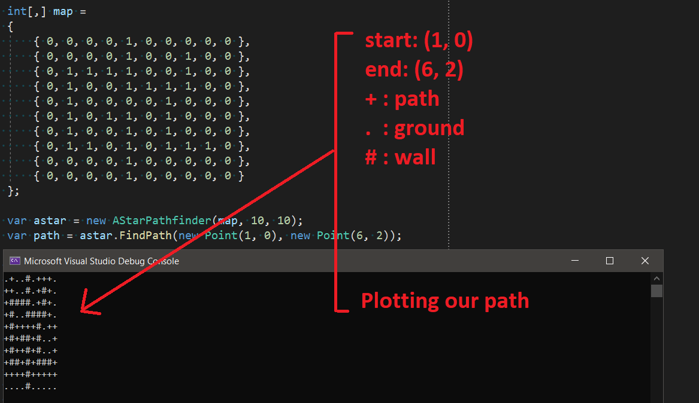

# AStarPathFinder
A* path finding implementation

```
// This is a quick and dirty port of the Python code from:
// https://medium.com/@nicholas.w.swift/easy-a-star-pathfinding-7e6689c7f7b2
//
// We aren't trying to do anything special or claim any brilliant insights
// on A* algorithm implementations. We simply need a quick and dirty
// implementation for a game so that we don't have to pull in any external
// dependencies that in turn bring in their own view of the world which
// never meshes with ours.
```



Frank Hale &lt;frankhaledevelops@gmail.com&gt;

27 March 2021